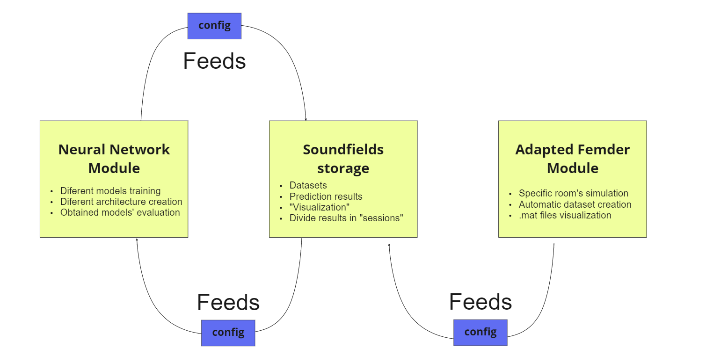

# Soundfield Integrated Tool

### Tool developed to integrate a module for soundfield's creation and another for neural networks development, aiming to ease the task of generating models to predict soundfields from few measurements.

&nbsp;

#### This tool was developed by Alexandre Otávio Guedes Drummond as Graduation Project, required to adquire the title of Bachelor on Acoustical Engineering  at UFSM. June, 2022.

----
&nbsp;

### This repository unites the repos based on two other projects, from different authors, both acknowledged on its' project repo's.  The modules are related according to the schema:





### As each project was coupled as submodule, it must be cloned using the following steps:

&nbsp;
```
git clone https://github.com/aogdrummond/soundfields_integrated_tool.git
cd soundfields_integrated_tool
git submodule init
git submodule update
```
&nbsp;

### From this point on, just follow each module instalation step independently.

